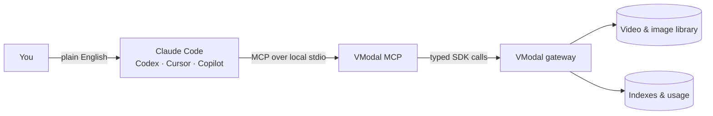

<div align="center">
  
  <h1>VModal MCP</h1>
  <p><strong>Give your AI assistant eyes for every video and image you own.</strong></p>
  <p>Search moments in natural language. Upload media. Build indexes.<br>Stay inside Claude Code, Codex, Cursor, or GitHub Copilot.</p>
  <a href="#start-in-minutes"><strong>Get started</strong></a>
  &nbsp;&middot;&nbsp;
  <a href="#things-you-can-ask"><strong>See what it can do</strong></a>
  &nbsp;&middot;&nbsp;
  <a href="#toolbox-for-pro-users"><strong>Pro toolbox</strong></a>
  <br><br>
  
  
  
  
</div>

<br>


<p align="center"><em>Stop scrubbing through timelines. Ask for the moment you need.</em></p>

## Your media library, now conversational

VModal MCP connects an MCP-compatible assistant to the VModal video and image API. You describe the outcome; your assistant selects the right typed tool, asks for missing details, and returns a focused result.

| You say | VModal MCP does |
|---|---|
| “Find the person walking beside the ocean.” | Searches video and image content by meaning |
| “Upload this folder to my travel collection.” | Runs signed single or bulk uploads |
| “Index the collection and tell me when it is ready.” | Starts and monitors an indexing job |
| “Show me the matching frame.” | Resolves and saves signed image results locally |
| “How much have I used this month?” | Reads account usage and service statistics |

No SDK code is required for everyday use. One local server gives your assistant two dozen focused tools for search, upload, collections, indexes, images, storage, and account status.

## Pick your path

| I am a… | Start here | What you get |
|---|---|---|
| **Normal user** | [Install and connect](#start-in-minutes) | Search and organize media using plain-English requests |
| **Prosumer** | [Try complete workflows](#things-you-can-ask) | Upload → index → search without leaving your assistant |
| **Pro user** | [Review the tool surface](#toolbox-for-pro-users) | Typed schemas, predictable names, local-file controls, and operational tools |

## Start in minutes

### 1. Get an API key

Join the VModal beta through the [contact form](https://v-modal.com/page/contact.ts). Keep the key private and never commit it to a repository.

### 2. Install the server

```bash
python -m pip install --upgrade "git+https://github.com/v-modal/vmodal_mcp.git@main"
vmodal-mcp --help
```

Requires Python 3.10 or newer. The installer uses your active Python environment; it does not create a virtual or Conda environment.

### 3. Connect your assistant

Replace `PUT_API_KEY_HERE` with your VModal API key.

<details open>
<summary><strong>Claude Code</strong></summary>

```bash
claude mcp add --scope user vmodal \
  -e api_key=PUT_API_KEY_HERE -- \
  vmodal-mcp run --transport stdio

claude mcp list
```

</details>

<details>
<summary><strong>Codex</strong></summary>

```bash
codex mcp add --env api_key=PUT_API_KEY_HERE vmodal -- \
  vmodal-mcp run --transport stdio

codex mcp list
```

</details>

<details>
<summary><strong>GitHub Copilot CLI</strong></summary>

```bash
copilot mcp add vmodal --env api_key=PUT_API_KEY_HERE -- \
  vmodal-mcp run --transport stdio

copilot mcp list
```

</details>

<details>
<summary><strong>Cursor and other JSON-based clients</strong></summary>

```json
{
  "mcpServers": {
    "vmodal": {
      "command": "vmodal-mcp",
      "args": ["run", "--transport", "stdio"],
      "env": {
        "api_key": "PUT_API_KEY_HERE"
      }
    }
  }
}
```

For Cursor, save this as `.cursor/mcp.json` in the project or `~/.cursor/mcp.json` for every project.

</details>

Restart your MCP client after adding the server. Then ask:

> Call the VModal `health` tool, then call `auth_me`.

A successful `auth_me` result confirms that the API key is connected to your account.

## Things you can ask

Copy, adapt, and send any of these prompts to your assistant.

### Find a moment

> Search my videos for “a cyclist crossing a bridge at sunset.” Return the best five matches and show me the top frame.

### Build a searchable collection

> Upload `./my_trip.mp4` to the `travel_diaries` collection, create its index, and monitor the job until it finishes.

### Process a folder

> Upload the MP4 files in `./camera_exports` to my `product_demos` collection. Summarize what succeeded and what needs attention.

### Curate and maintain

> List my collection groups, add a description and tags to `launch_demo.mp4`, then show the current indexing jobs.

### Check the account

> Show my VModal usage and cache statistics. Explain the result in plain language.

Your MCP client can show tool calls before they run and ask for values that are missing. Destructive collection and index operations expose explicit dry-run and confirmation inputs.

## How it fits together



The MCP server follows the official [MCP client-server architecture](https://modelcontextprotocol.io/docs/learn/architecture). It runs locally and communicates with the client over standard input/output. Your API key is passed to that local process and used as the bearer identity for VModal gateway requests.

## Toolbox for pro users

| Area | Representative tools | Purpose |
|---|---|---|
| Connection | `health`, `auth_me` | Verify service health and identity |
| Discovery | `search_video`, `collection_groups_list` | Search content and discover collection scopes |
| Ingestion | `collection_video_upload`, `collection_video_upload_bulk`, `collection_upload_metadata` | Add one file, a folder, or metadata |
| Collections | `collection_description_update`, `collection_add_assets`, `collection_delete` | Maintain collection content and metadata |
| Indexes | `index_create`, `index_status`, `index_jobs_list`, `index_delete` | Control the indexing lifecycle |
| Images | `image_get_url`, `image_get_url_bulk`, `image_get_from_url`, `image_get_bulk_from_urls` | Resolve and download matching frames |
| Operations | `admin_usage`, `admin_user_stats`, `admin_cache_stats` | Inspect usage and runtime statistics |
| Storage | `r2_credentials`, `r2_presign_upload_file`, `r2_presign_upload_folder_video` | Work with temporary R2 upload access |

Tool inputs are generated from the VModal Python SDK where possible, keeping MCP behavior aligned with the reference client. Search responses are trimmed for assistant-friendly context, while typed schemas preserve required fields and defaults. Upload tools accept local filesystem paths instead of Python file objects.

Your MCP client discovers the exact tool schemas from the running server. Restart the client after upgrading VModal MCP so it refreshes names, inputs, defaults, and descriptions.

## Troubleshooting

| Symptom | Fix |
|---|---|
| `vmodal-mcp: command not found` | Restart the client and add `python -c "import sysconfig; print(sysconfig.get_path('scripts'))"` to `PATH` |
| `401` | Check that the API key is present, valid, and not expired |
| `403` | The key is valid, but the account cannot perform that operation |
| New tools are missing | Restart the MCP client so it reconnects and refreshes the tool list |
| Unsure whether the server starts | Run `vmodal-mcp run --transport stdio` directly for a quick check |

## Development

```bash
git clone https://github.com/v-modal/vmodal_mcp.git
cd vmodal_mcp
python -m pip install -e .
vmodal-mcp --help
```

---

<p align="center"><strong>Your assistant already understands your question. Now it can understand your media.</strong></p>
